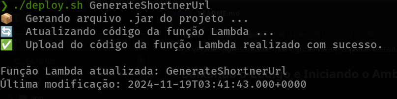
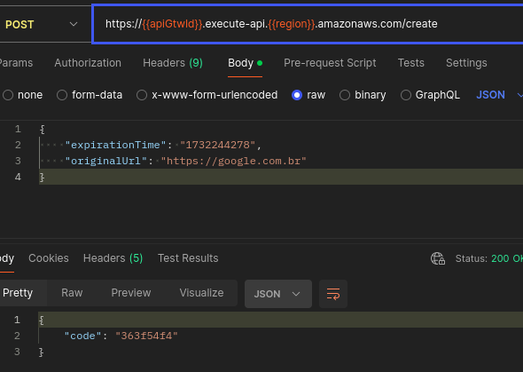

# Projeto Create Url Lambda

   Este repositório implementa a aplicação responsável por gerar e armazenar os links encurtados em um bucket S3,  aplicação faz parte do sistema serverless de encurtamento de URLs que utiliza AWS Lambda, desenvolvido durante o curso de Java da Rocketseat. O sistema tem como foco permitir que usuários criem URLs curtas que redirecionem para URLs originais.  

   Repositório da aplicação responsável por gerenciar o redirecionamento: [Aplicação de redirecionamento](https://github.com/Jefferson-LFS/redirect-url-shortener).

## Pré-requisitos

- JDK: 17 
- Maven
- IDE: IntelliJ IDEA
- Teste de endpoints: Postman/insomnia; 
- Deploy: 
   - O AWS CLI precisa estar instalado e configurado no seu sistema.
   - Para instalar o AWS CLI, siga as instruções na [documentação oficial](https://docs.aws.amazon.com/cli/latest/userguide/install-cliv2.html).
   - Para configurar o AWS CLI com suas credenciais da AWS, use `aws configure` e preencha com sua AWS Access Key, AWS Secret Key e region.
   

## Configuração do Ambiente

1. Clone este repositório em sua máquina local.
2. Certifique-se de ter instalado todos os pré-requisitos listados acima.
3. Importe o projeto.
4. Execute o comando `mvn clean install` para baixar as dependências e construir o projeto.
5. Crei a função Lambda no console da AWS.

## Deploy do código da função Lambda para AWS


```
$ cd deploy
$ chmod +x deploy.sh 
$ ./deploy.sh <NomeDaFuncaoLambda>
```
## Resultado do Deploy



## Testando Aplicação



## Estrutura do Projeto

- `src/main/java`: Contém o código-fonte da aplicação.
- `src/main/resources`: Contém arquivos de configuração.